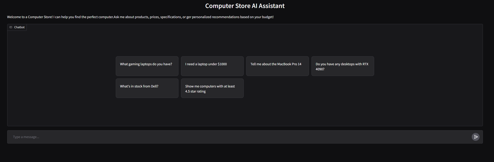
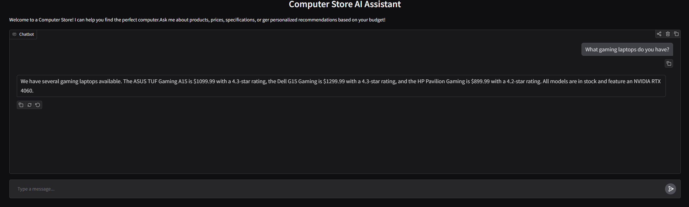
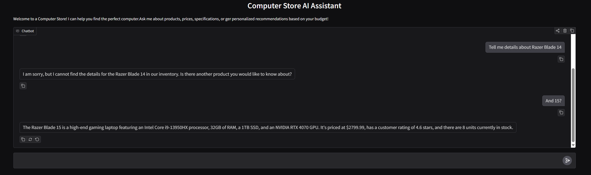
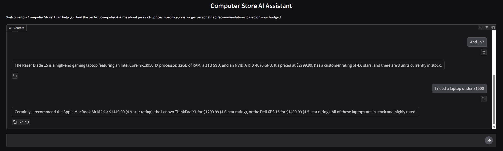

# Computer Store AI Assistant

A conversational AI-powered chatbot that helps customers find the perfect computer. Built with Gradio and powered by Google's Gemini AI, this assistant provides intelligent product recommendations, searches, and detailed information about computers in stock.

## Features
- Natural Language Search: Ask questions in plain English to find computers

- Smart Recommendations: Get personalized suggestions based on your budget and needs

- Real-time Stock Checking: Verify product availability instantly

- Detailed Product Information: Access complete specifications, pricing, and ratings

- Function Calling: Uses AI tool calling to query a PostgreSQL database dynamically

- User-Friendly Interface: Clean Gradio chat interface with example prompts




## Tech stack
- Frontend: Gradio

- AI Model: Google Gemini 2.5 Flash (via OpenAI-compatible API)

- Database: PostgreSQL

- Backend: Python 3.x

- Key Libraries:

  - gradio - Web UI

  - openai - API client

  - psycopg2 - PostgreSQL adapter

  - python-dotenv - Environment variable management

## Project structure 
```text
├── app.py                # Main application entry point
├── src/
│   ├── chatbot.py        # Chat logic and tool orchestration
│   ├── config.py         # Configuration and environment setup
│   ├── database.py       # Database initialization and connection management
│   └── tools.py          # Function definitions for AI tool calling
├── data/
│   └── products.csv      # Product inventory data
├── requirements.txt      # Python dependencies
└── .env                  # Environment variables (not tracked in git)
```

## Setup instructions

### Prerequisites
- Python 3.8+

- PostgreSQL installed and running

- Gemini API key

### Installation
1. Clone the repository
```bash
git clone https://github.com/Kaskra13/computer_store_chatbot
cd computer-store-ai-assistant
```

2. Install dependencies
```bash
pip install -r requirements.txt
```

3. Set up environment variables

Create a `.env` file in the root directory:
```text
GEMINI_API_KEY=your_gemini_api_key_here
DB_HOST=localhost
DB_PORT=5432
DB_NAME=computer_store
DB_USER=postgres
DB_PASSWORD=your_postgres_password
```

4. Initialize the database

The application will automatically create the database and populate it with sample data from `data/products.csv` on first run.

5. Run the application
```bash
python app.py
```
The app will launch in your default browser automatically.

## How it works
1. User asks a question in natural language

2. The AI determines which tools (functions) to call

3. Functions query the PostgreSQL database

4. Results are formatted and returned to the user

5. The AI provides a conversational, helpful response





## Features in detail
### AI tools
The chatbot has access to four specialized functions:

- search_products: Find computers by keywords, price range, rating, or category

- get_product_details: Get full specifications for a specific product

- check_stock: Verify real-time availability

- get_budget_recommendations: Get top picks within a budget

### Error handling
Robust error handling for:

- API rate limits

- Connection issues

- Authentication errors

- Database errors

- Timeout handling
